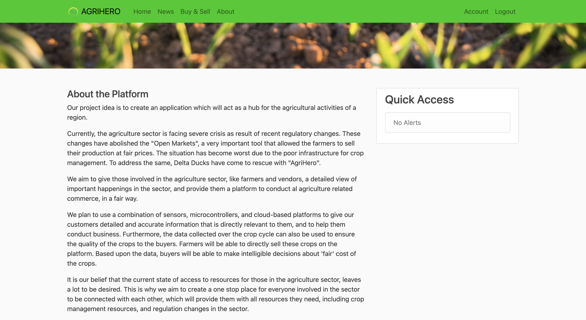

# AgriHero

**NOTE**:
*The Project is still in progress and all the code files are not aviablable on github yet.*

## Project Abstract

Our project idea is to create an application which will act as a hub for the agricultural activities of a region.
Currently, the agriculture sector is facing severe crisis as result of recent regulatory changes. These changes have abolished the **Open Markets**, a very important tool that allowed the farmers to sell their production at fair prices. The situation has become worst due to the poor infrastructure for crop management. To address the same, Delta Ducks have come to rescue with "AgriHero".
We aim to give those involved in the agriculture sector, like farmers and vendors, a detailed view of important happenings in the sector, and provide them a platform to conduct al agriculture related commerce, in a fair way.
We plan to use a combination of sensors, microcontrollers, and cloud-based platforms to give our customers detailed and accurate information that is directly relevant to them, and to help them conduct business. Furthermore, the data collected over the crop cycle can also be used to ensure the quality of the crops to the buyers. Farmers will be able to directly sell these crops on the platform. Based upon the data, buyers will be able to make intelligible decisions about 'fair' cost of the crops.
It is our belief that the current state of access to resources for those in the agriculture sector, leaves a lot to be desired. This is why we aim to create a one stop place for everyone involved in the sector to be connected with each other, which will provide them with all resources they need, including crop management resources, and regulation changes in the sector.

## Details of the Tech Stack Used

For Our Website we are using the following : 
* Flask : We are using flask platform as micro web programming in python. Flask  python programming will forward data from databases to platform.
* MySQL database : Database stores the data values collected from the sensors.
* HTML5 & CSS3 : Html and Css will help us to create web interfaces
* Bootstrap and Javascript : Bootstrap templete creates responsive web platform and java-script  enhances the user interface.

For the farm monitoring system we will be be using the following hardware :
1) Rasberry Pi 
2) ESP32 CAM
3) Rain Sensor
4) Soil Moisture Sensor
5) LDR Sensor
6) Gas Sensor
7) Temperature And Humidity Sensor
The data collected from these sensors will be sent in real time to the cloud platform where the data will be further analyzed.
 
  
## How to use?
* The Website is live [here](https://agrihero-webapp.herokuapp.com/).
* The Website can also be used locally by using the following commands:
1. Download the code from Github .
2. Install all the Dependencies using the command `pip3 install -r requirements.txt`.
3. Uncomment Line 215 and 216 in `applet.py` file.
4. To run the code use command `python applet.py`

## Screenshots
**About Page**

**Home Page**

**Home Page with Alerts**

**Buy & Sell Page**

**Buy Page with all Listings**

**Buy Page for Individual Listing**

**Sell Page**

**News Page**

**Login Page**

**Register Page**

